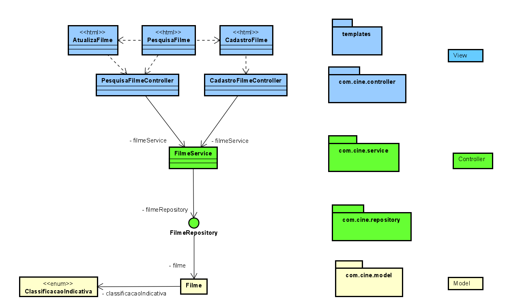

# Cineshow

### Projeto para uma aplicação Web que gerencie cinemas, tornado o usuário capaz de cadastrar sua infraestrutura (salas de cinema), sessões, e filmes que serão exibidos, além de relizar vendas.

#### TECNOLOGIAS:
- Java com Spring e Lombok,
- Thymeleaf
- HTML, CSS, Bootstrap,
- Banco de Dados MySQL

 
    
    
    
    
    
    
    

---

### Modelo de Casos de Uso
 
 

Os casos de uso na cor azul foram implementados, enquanto que o caso de uso "Validar Ingresso" foi feito pensando em uma estrutura física: antes de entrar na sala onde o filme será exbido, um funcionário do estabelecimento valida o ingresso, para que não posse ser utilizado mais de uma vez.

### Diagrama de Classes

### Arquitetura

Essa arquitetura foi modelada utilizando o caso de uso "Gerenciar Filmes" como exemplo, mas será replicada para os demais casos de uso.

Utilizei o padrão de projeto MVC, uma camada Service para restringir a quantidade de classes que tem acesso ao meu Repository. 

